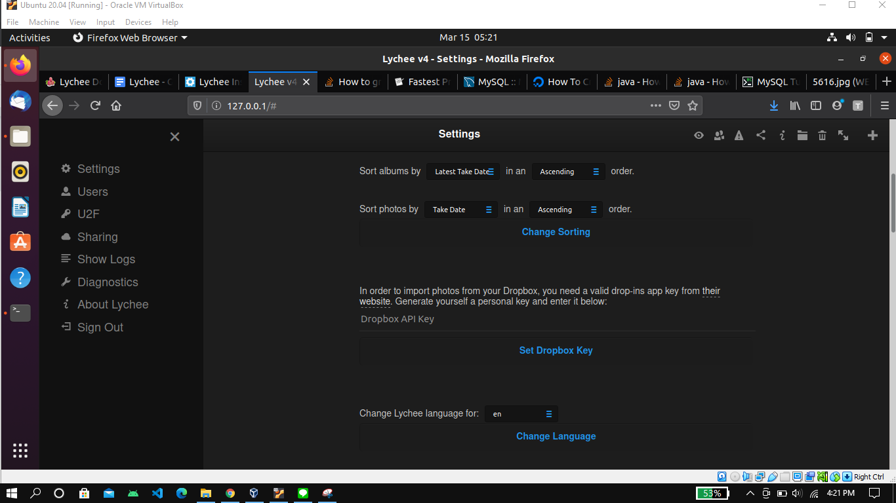
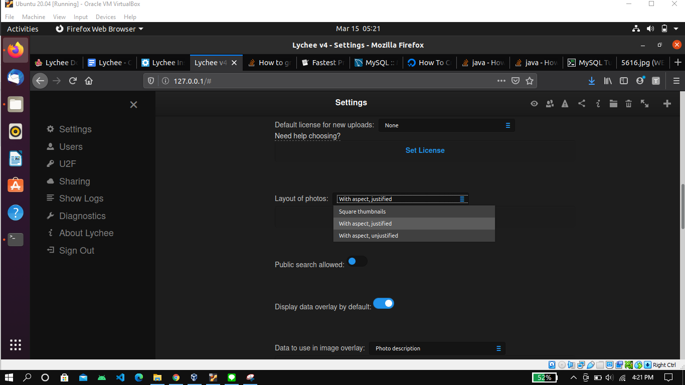
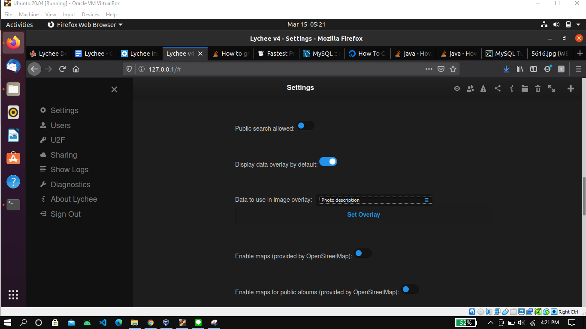
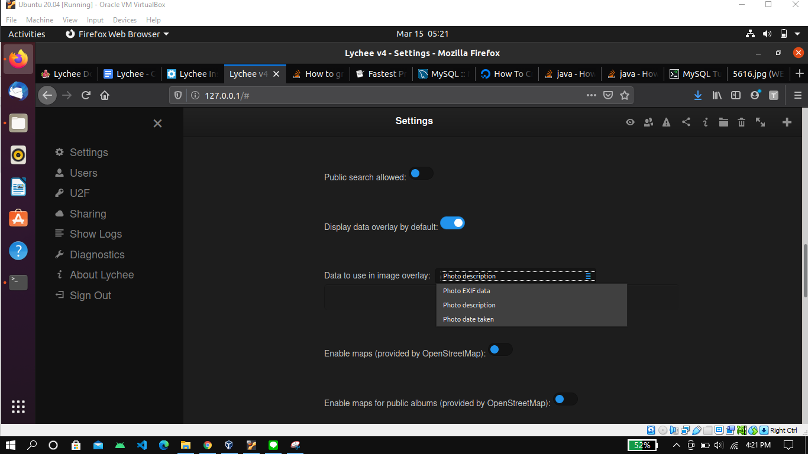
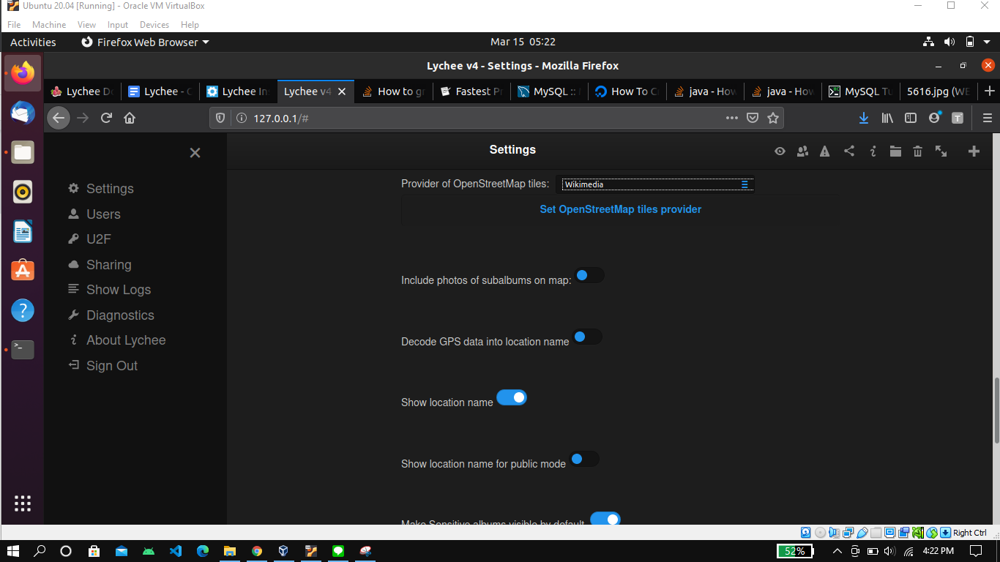
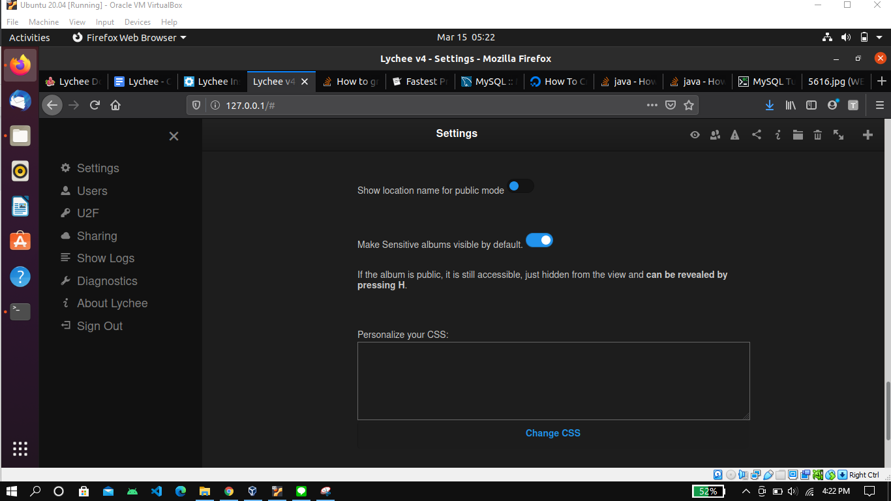

<h1 align="center"></h1>

[Sekilas Tentang](#sekilas-tentang) | [Instalasi](#instalasi) | [Konfigurasi](#konfigurasi) | [Otomatisasi](#otomatisasi) | [Cara Pemakaian](#cara-pemakaian) | [Pembahasan](#pembahasan) | [Referensi](#referensi)
:---:|:---:|:---:|:---:|:---:|:---:|:---:


# Sekilas Tentang
[`^ kembali ke atas ^`](#)

**Lychee** merupakan *photo-management-system* yang dapat diakses secara gratis. Semenjak 1 April 2018 , **Lychee** berada pada naungan organisasinya sendiri (*LycheeOrg*) dimana semua orang dapat menambahkan perbaikan pada **Lychee**.

# Instalasi
[`^ kembali ke atas ^`](#)

#### Kebutuhan Sistem :
- Webserver (Apache atau nginx)
- MySQL >5.7.8 / MariaDB 10.2 / Lychee's inbuilt SQLite3 support
- PHP >= 7.4 with various extension.
- RAM minimal 512 MB
- Hard Disk Space minimal 25 GB
- CPU minimal 2Ghz Dual Processor

#### Proses Instalasi :
1. Login ke server dengan username dan password masing masing

2. Install dan update kebutuhan sistem seperti `Apache`, `PHP`, dan `MySQL`.
   ```
    $ sudo apt-get update
    $ sudo apt-get install apache2
    $ sudo apt-get install mysql-server
    $ sudo apt-get install php
    $ sudo apt-get install libapache2-mod-php
    $ sudo apt-get install php-mysql
    $ sudo apt-get install openssl php-common php-curl php-json php-mbstring php-mysql php-xml php-zip php-tokenizer php-gd php-imagick
    $ dpkg --list | grep php
   ```
3. Install Lychee dengan menggunakan `Composer`
   ```
    $ sudo apt-get install git
    $ sudo apt-get install composer
    $ sudo chmod 777 /var/www/html
    $ git clone https://www.github.com/LycheeOrg/Lychee /var/www/html/Lychee
    $ cd /var/www/html/Lychee
    $ composer install --no-dev
    $ sudo chown -R www-data:www-data /var/www/html/Lychee
    $ sudo chmod -R 775 /var/www/html/Lychee

   ```
4. File konfigurasi `Apache`.
   - Menghapus konfigurasi default
     ```
      $ sudo rm /etc/apache2/sites-available/000-default.conf
      $ sudo rm /etc/apache2/sites-enabled/000-default.conf
     ```
   - Membuat konfigurasi baru untuk lychee
     ```
      $ sudo a2enmod rewrite
      $ sudo touch /etc/apache2/sites-available/lychee.conf
      $ sudo nano /etc/apache2/sites-available/lychee.conf
     ```
 5. Pada konfigurasi `Apache` baru yang terbuka, isikan konfigurasi sebagai berikut
     ```
     <VirtualHost *:80>
      ServerAdmin admin@your-domain.com
      DocumentRoot /var/www/html/Lychee/public
      ServerName your-domain.com
      ServerAlias www.your-domain.com
      <Directory /var/www/html/Lychee/>
      Options FollowSymLinks
      AllowOverride All
      Order allow,deny
      allow from all
      </Directory>
      ErrorLog /var/log/apache2/your-domain.com-error_log
      CustomLog /var/log/apache2/your-domain.com-access_log common
      </VirtualHost>
     ```
 6. Mennyalakan site `Apache`.
     ```
      $ sudo a2ensite lychee.conf (pada directory /var/www/html/)
     ```
 7. Merestart `Apache`.
     ```
      $ sudo service apache2 restart
     ```
 8. Mengecek IP Adress komputer.
     ```
      $ hostname -I
     ```
 9. Instalasi lanjutan 
      - Welcome to **Lychee**
        
      - Mengecek kelengkapan `Apache` dan `PHP`.
        
        
      - Mengecek *Permission*
        
        
      - Membuat database dan mengedit konfigurasi
        
        
        
        
         ```
            $ sudo mysql -u root -p -v -e "
               CREATE DATABASE lychee;
               CREATE USER 'lycheeuser'@'localhost' IDENTIFIED BY 'lycheepassword';
               GRANT ALL PRIVILEGES ON lychee.* TO 'lycheeuser'@'localhost';
               FLUSH PRIVILEGES;"
               
            DB_CONNECTION=mysql
            DB_HOST=localhost
            DB_PORT=3306
            DB_DATABASE=lychee
            DB_USERNAME=lycheeuser
            DB_PASSWORD=lycheepassword
            DB_LOG_SQL=false
         ```
       - Jika berhasil maka muncul status "Application key set successfully"
         
         

# Konfigurasi
[`^ kembali ke atas ^`](#)
1. Pengaturan *Sorting* dan *Dropbox key* untuk menghubungkan ke *Dropbox*



2. Pengaturan *Layout*



3. Pengaturan *Image Overlay*




4. Pengaturan lokasi foto



5. Pengaturan *Visibility* dan CSS 




# Maintenance
[`^ kembali ke atas ^`](#)
* ### Logs

* ### Diagnostic


# Otomatisasi
[`^ kembali ke atas ^`](#)


# Cara Pemakaian
[`^ kembali ke atas ^`](#)
* ### Import from link 
1. 

2. 

3. 

* ### Favorite

* ### Move 

* ### Rotate
1.

2. 

* ### About

* ### Delete photo

* ### Visibility


* ### Share photo

* ### Photo View 


# Pembahasan
[`^ kembali ke atas ^`](#)

Software management foto ini memberikan banyak fitur bermanfaat untuk pengelolaan foto. 
Memberikan akses kepada pengguna untuk membuat repository foto untuk server websitenya.


# Referensi
[`^ kembali ke atas ^`](#)


1. [How to install Lychee on Ubuntu 16.04](https://www.youtube.com/watch?v=MpkJCrRfVCQ) - Youtube
2. [Cara Install Ubuntu Server 18.04 LTS pada Virtual Machine](https://degananda.com/cara-install-ubuntu-server-18-04-lts-pada-virtual-machine/) - degananda.com
3. [Lychee Prologue](https://lycheeorg.github.io/docs/org.html) - Github
